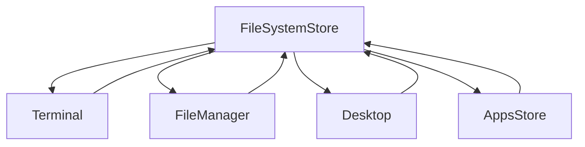

# Sistema de Arquivos Integrado

Este sistema conecta todos os componentes do seu portfólio (área de trabalho, file manager, terminal e aplicativos) através de uma store centralizada e reativa.

## Arquitetura

### 🏪 Store Principal: `useFileSystemStore`
- **Localização**: `/src/stores/useFileSystemStore.js`
- **Responsabilidade**: Gerenciar todo o sistema de arquivos simulado
- **Características**:
  - Estado reativo com Vue 3
  - Eventos em tempo real
  - Sincronização automática entre componentes
  - Operações CRUD completas

### 🔗 Integração entre Componentes



## Componentes Principais

### 1. **Terminal** (`TerminalComponent.vue`)
- Comandos Unix-like funcionais: `ls`, `cd`, `pwd`, `cat`, `mkdir`, `touch`, `rm`, `find`, `tree`
- Prompt dinâmico que reflete o diretório atual
- Mudanças refletem automaticamente em outros componentes

### 2. **File Manager** (`FileManager.vue`)
- Interface gráfica completa para navegação
- Suporte a arrastar e soltar
- Criação/edição/exclusão de arquivos/pastas
- Sincronização em tempo real com terminal e desktop

### 3. **Desktop** (`Desktop.vue`)
- Área de trabalho com ícones arrastáveis
- Context menu com ações
- Integração com AppsStore para aplicativos
- Grid inteligente para posicionamento

### 4. **Sidebar File System** (`sidebarFileSystem.vue`)
- Navegação rápida por favoritos
- Dispositivos e locais do sistema
- Integração com lixeira

## Como Usar

### Inicialização
```javascript
// Em qualquer componente
import { useFileSystemStore } from '@/stores/useFileSystemStore';

const fileSystemStore = useFileSystemStore();
```

### Operações Básicas

#### Navegação
```javascript
// Mudar diretório
fileSystemStore.changeDirectory('/home/amorim/Documents');

// Voltar
fileSystemStore.goBack();

// Obter diretório atual
const currentPath = fileSystemStore.currentPath;
const currentContents = fileSystemStore.currentDirectoryContents;
```

#### Criar Arquivos/Pastas
```javascript
// Criar arquivo
const result = fileSystemStore.createFile('meuarquivo.txt', 'conteúdo');

// Criar diretório
const result = fileSystemStore.createDirectory('minhapasta');

// Verificar resultado
if (result.success) {
    console.log('Criado com sucesso!');
} else {
    console.error(result.error);
}
```

#### Ler/Escrever Arquivos
```javascript
// Ler arquivo
const content = fileSystemStore.readFile('/home/amorim/Documents/arquivo.txt');

// Escrever arquivo
fileSystemStore.writeFile('/home/amorim/Documents/arquivo.txt', 'novo conteúdo');
```

#### Buscar Arquivos
```javascript
const results = fileSystemStore.searchFiles('*.js');
console.log(results); // Array de arquivos encontrados
```

### Integração com Desktop
```javascript
// Adicionar item ao desktop
fileSystemStore.addToDesktop({
    name: 'Meu App',
    type: 'file',
    icon: '🚀',
    content: 'dados do app'
});
```

### Escutar Mudanças
```javascript
// Reagir a mudanças no sistema de arquivos
const unsubscribe = fileSystemStore.onFileSystemChange((event) => {
    console.log(`Operação: ${event.operation}`);
    console.log(`Tipo: ${event.type}`);
    console.log(`Caminho: ${event.path}`);
});

// Limpar listener
onUnmounted(() => {
    unsubscribe();
});
```

## Comandos do Terminal

### Navegação
- `pwd` - Mostra diretório atual
- `cd <path>` - Muda diretório
- `ls [options]` - Lista arquivos
  - `-l` - Formato detalhado
  - `-a` - Inclui arquivos ocultos

### Manipulação
- `mkdir <name>` - Cria diretório
- `touch <name>` - Cria arquivo
- `rm <name>` - Remove arquivo/diretório
- `cat <file>` - Mostra conteúdo

### Informações
- `tree` - Mostra estrutura em árvore
- `find <pattern>` - Busca arquivos
- `file <path>` - Mostra tipo de arquivo
- `wc <file>` - Conta linhas/palavras/caracteres

## Sincronização em Tempo Real

### Exemplo Prático
1. **No Terminal**: `mkdir Nova_Pasta`
2. **No File Manager**: A pasta aparece automaticamente
3. **No Desktop**: Se estiver visualizando a mesma pasta, a atualização é instantânea

### Como Funciona
- Todas as operações emitem eventos através de `emitFileSystemChange()`
- Componentes escutam esses eventos e se atualizam automaticamente
- Estado reativo do Vue garante que mudanças sejam refletidas na UI

## Estrutura de Dados

### Item do Sistema de Arquivos
```javascript
{
    type: 'file' | 'dir',
    permissions: '-rw-r--r--',
    owner: 'amorim',
    group: 'amorim', 
    size: 1024,
    modified: Date,
    content: 'conteúdo do arquivo', // apenas para arquivos
    contents: {} // apenas para diretórios
}
```

### Evento de Mudança
```javascript
{
    operation: 'create' | 'delete' | 'modify' | 'move',
    type: 'file' | 'dir',
    path: '/caminho/completo',
    timestamp: Date
}
```

## Extensibilidade

### Adicionar Novo Tipo de Arquivo
```javascript
// No Desktop.vue ou FileManager.vue
const getFileIcon = (item) => {
    const ext = item.name.split('.').pop()?.toLowerCase();
    const iconMap = {
        // ... ícones existentes
        'py': '🐍',
        'cpp': '⚙️'
    };
    return iconMap[ext] || '📄';
};
```

### Criar Novo Comando Terminal
```javascript
// No TerminalCommandsService.js
export const meuComando = (args) => {
    const fs = getFileSystemStore();
    // Lógica do comando
    return 'resultado';
};

// Adicionar ao mapa de comandos
export const commands = {
    // ...comandos existentes
    'meucomando': meuComando
};
```

### Integrar com Aplicativos
```javascript
// No seu componente de app
import { useFileSystemStore } from '@/stores/useFileSystemStore';

const fileSystemStore = useFileSystemStore();

// Salvar dados do app como arquivo
const saveAppData = (data) => {
    fileSystemStore.createFile(
        'dados_app.json', 
        JSON.stringify(data),
        '/home/amorim/Documents'
    );
};
```

## Performance

- **Lazy Loading**: Componentes carregam a store apenas quando necessário
- **Eventos Otimizados**: Apenas componentes interessados recebem notificações
- **Estrutura Reativa**: Vue 3 garante atualizações eficientes
- **Debouncing**: Operações frequentes são otimizadas

## Debugging

### Logs de Sistema
```javascript
// Habilitar logs detalhados
const unsubscribe = fileSystemStore.onFileSystemChange((event) => {
    console.log('[FileSystem]', event);
});
```

### Inspecionar Estado
```javascript
// No Vue DevTools
console.log(fileSystemStore.fileSystem);
console.log(fileSystemStore.currentDirectoryContents);
```

Este sistema fornece uma base sólida e extensível para simular um sistema operacional completo no navegador, mantendo todos os componentes sincronizados em tempo real.
